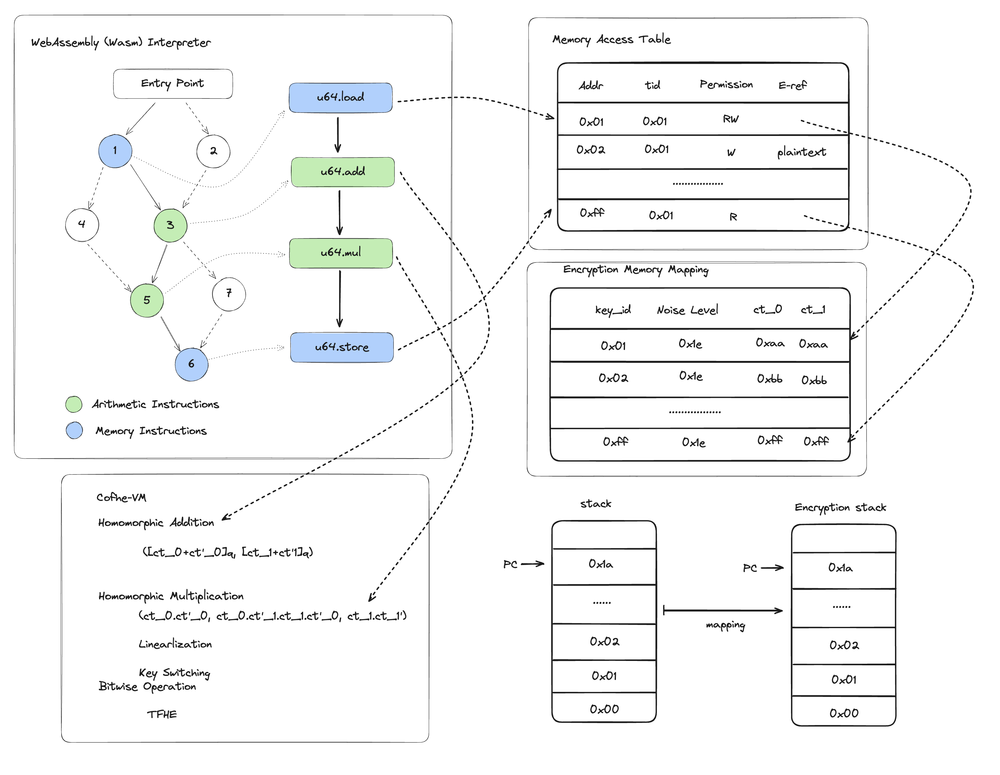

# FHE-Wasm Framework
The FHE-Wasm framework is illustrated in the following diagram:

We divide the core into 3 parts:
1.	Initialization: This step mainly initializes all the corresponding tables, including memory table, stack table, code table, global data (plaintext) part, etc. In addition, we designed a mapping reference table for the memory access table and the stack table, where E-ref indexes the corresponding ciphertext (ct), noise level, key_id, etc. This is to facilitate the isolation of direct operations on the data structure of the memory access table.(right part)
2.	Tracing: The Runtime Interpreter traces the execution trace of the Wasm runtime. Each instruction is divided into arithmetic instructions, memory instructions, etc. For memory instructions, operations can be performed on the stack through the memory access table and the corresponding encrypted mapping. (top left)
3.	Cofhe VM: In the early stages, we will handle the scheme for Somewhat Homomorphic Encryption (SHE) using BFV. In the later stages, we will adopt a Fully Homomorphic Encryption (FHE) scheme based on TFHE. (bottom left)